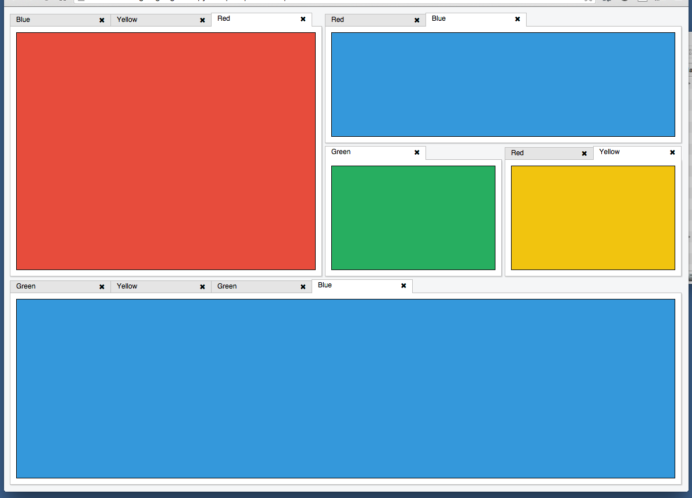

## What is Phosphor ?

 Phosphor is a few things:

    - A high performance paneled/tabbed/docked layout system. There is truly nothing else out there like this right now.

    - A virtual DOM component system that designed for content inside that
      layout system. It would be simple enough to also use of other component inside it(like react.js components)
      inside the phosphor layout logic as well.

      react.js from the component perspective.
      
     
## Examples.

### Tabbed layout :

### Why use phosphor. 

Without going into detail, there is a very specific class of layout problems
which Phosphor solves which are not possible to express in CSS.  Making any
change to a page which will requires the geometry to update will cause a
reflow. The key is minimizing the number of reflows. Just writing to a CSS
property will not trigger an immediate reflow. It marks the DOM as dirty and
schedules a layout (reflow) which will be performed on the next cycle of the
event loop, or when geometry information (offsetWidth/Height etc...) are read
from the DOM. You can make as many synchronous writes to the DOM as you want,
and provided you never read from the DOM, you will only get one reflow when the
page finally updates.A

The CSS layout algorithms are necessarily complex in order handle things like
text-wrapping, box-flow, RTL-text, floats, clears, etc... Phosphor does none of
that, leading to a much simpler layout algorithm which can be implemented
efficiently. Javascript is not the bottleneck, it's the algorithms (there are
JS game engines that run at 60fps). The first version of Phosphor used flexbox
to implement layout - it was slow because of the excessive inline reflows which
were needed to implement aggregate geometry constraints, which leads me to my
next point.

One key feature of Phosphor layouts is that they allow you to achieve layouts
which are not possible with the standard CSS layout algorithms. A phosphor
panel/layout can be expanded to fill the available space and yet still have a
minimum and maximum size which is computed automatically based on the size
constraints of its children. This relationship is recursive and fully supported
in nested layout hierarchies of any depth.
